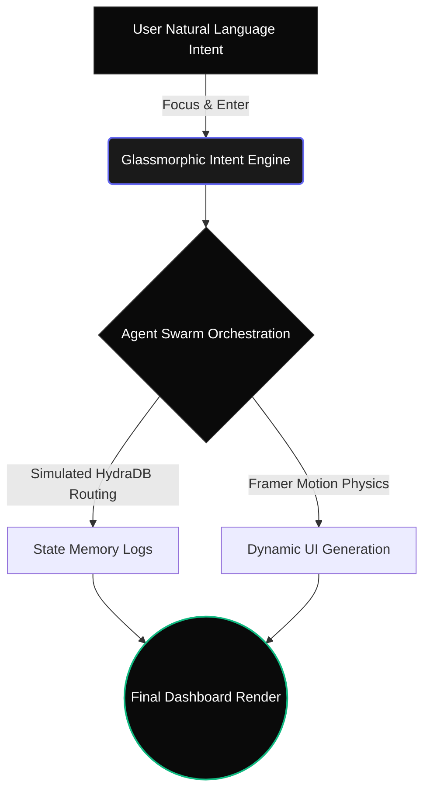

# Intent-OS Workspace

[Watch the Pitch Video Here](TERA_VIDEO_LINK_YAHAN_DAAL) | [View Live Demo on Vercel](TERA_VERCEL_LINK_YAHAN_DAAL)

The operating system layer is unbundling. The future isn't a better terminal; it is a completely transparent, intent-driven interface.

Intent-OS is a hyper-optimized frontend shell designed for the HydraDB Hackathon. Built completely zero-to-one using an AI-agentic workflow at 4:00 AM, this project aims to prove one thing: Multi-agent orchestration deserves a God-level UI.

## The Philosophy
While traditional platforms force users to learn complex CLI commands, Intent-OS borrows minimalism from top-tier hardware companies. You type a natural language intent, and the UI dynamically bends and transforms to serve that exact purpose. 

No loading spinners. No generic chat bubbles. Just "Silence + Transformation."

## Architecture Flow (The Metaphor)



## The Visual Advantage
- Intent-Driven Kernel: Replaces POSIX commands with natural language.
- Glassmorphic Aesthetic: Deep ultra-dark mode, subtle backdrop blurs, and neon cyber-tech shadows.
- Fluid Transformations: Uses Framer Motion spring physics to simulate zero-latency agentic output.

## Tech Stack
- Core: Next.js 15 (App Router)
- Styling: TailwindCSS v4
- Animations: Framer Motion
- Deployment: Vercel Edge Network

## Run Locally
```bash
git clone [https://github.com/dakshrawat298-gif/intent-os-workspace.git](https://github.com/dakshrawat298-gif/intent-os-workspace.git)
cd intent-os-workspace
npm install
npm run dev
```
